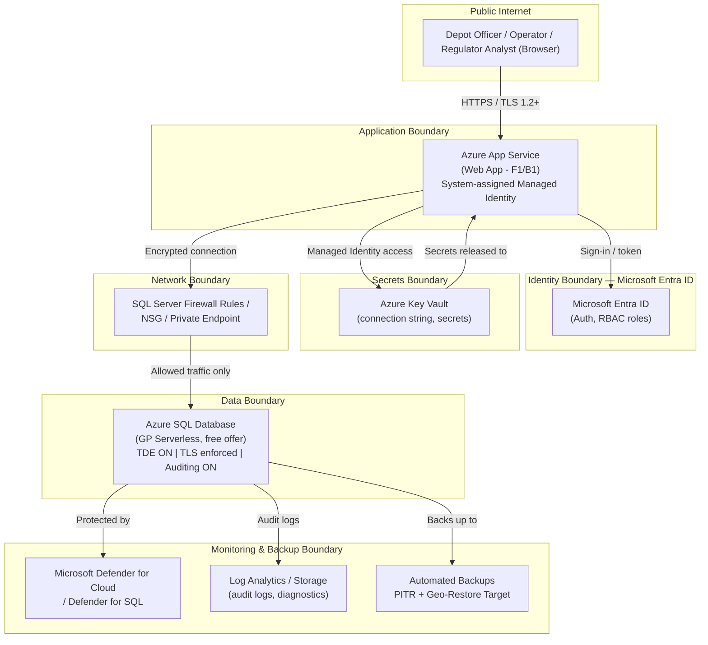

# Capstone Deliverable Templates
## Cloud, Database & Cybersecurity Essentials — Day 5 Capstone

Fill in each template below. Delete instructional italics before submission. These templates correspond to the three required deliverables in `Capstone_Project_Brief.md` and reuse the control categories from the **Day 4 security checklist**.

---

# TEMPLATE 1 — Architecture Diagram

> *Since freehand drawing tools may not be available, use ALL THREE of the following: (A) the component table, (B) the ASCII/text reference diagram, (C) the Mermaid diagram. Together they must show: cloud resources, database configuration, and security boundaries.*

## A. Component Table

| # | Component | Azure Service | Tier / SKU used | Purpose | Security boundary it belongs to |
|---|---|---|---|---|---|
| 1 | Web application | Azure App Service | e.g., F1 / B1 | Hosts the [Downstream Fuel Distribution Monitoring / Crude Oil Production & Royalty Reporting] app | Application boundary |
| 2 | Database | Azure SQL Database | e.g., GP Serverless (free offer) | Stores regulated submission data | Data boundary |
| 3 | Identity provider | Microsoft Entra ID | — | Authenticates users; issues roles | Identity boundary |
| 4 | Secrets store | Azure Key Vault | Standard | Holds DB connection string / app secrets | Identity/data boundary |
| 5 | Network control | NSG / Private Endpoint / SQL firewall rules | — | Restricts network paths to the DB | Network boundary |
| 6 | Threat protection | Microsoft Defender for Cloud (+ Defender for SQL) | Free/Standard | Posture management & alerts | Monitoring boundary |
| 7 | Audit/logging | Azure SQL Auditing + diagnostic settings / Log Analytics | — | Regulatory audit trail | Monitoring boundary |
| 8 | (Optional) Managed identity | System-assigned managed identity on App Service | — | Lets app authenticate to Key Vault/SQL without stored credentials | Identity boundary |

*Add/remove rows as needed for your actual build. Every row must map to something you can show evidence for (screenshot) in your submission.*

## B. Text / ASCII Reference Architecture

```
                                   INTERNET (public users: depot officers / operators)
                                              |
                                              |  HTTPS (TLS 1.2+, "HTTPS Only" enforced)
                                              v
                        +---------------------------------------------+
                        |         AZURE APP SERVICE (App tier)         |
                        |  [Fuel Distribution / Royalty Reporting app] |
                        |  - System-assigned Managed Identity          |
                        |  - Auth: Microsoft Entra ID sign-in          |
                        +---------------------+-------------------------+
                                              |
                    (A) IDENTITY BOUNDARY ----|---- Entra ID token issuance / RBAC role check
                                              |
                        +---------------------v-------------------------+
                        |   Key Vault  <----->  App Service (Managed ID)|
                        |   - DB connection string, app secrets         |
                        +---------------------+-------------------------+
                                              |
                    (B) NETWORK BOUNDARY -----|---- NSG rules / SQL server firewall / [Private Endpoint if implemented]
                                              |
                        +---------------------v-------------------------+
                        |           AZURE SQL DATABASE                  |
                        |   [db name] - GP Serverless (free offer)      |
                        |   - TDE: ON (encryption at rest)              |
                        |   - TLS enforced (encryption in transit)      |
                        |   - Auditing: ON -> Log Analytics/Storage     |
                        |   - Auto-pause: [x] min idle                  |
                        +---------------------+-------------------------+
                                              |
                    (C) DATA / MONITORING ----|---- Automated backups (PITR) + geo-restore target region
                        BOUNDARY               |
                                              v
                        +-----------------------------------------------+
                        |  Microsoft Defender for Cloud / Defender for  |
                        |  SQL  (posture + alerts across all layers)    |
                        +-----------------------------------------------+
```

*Label which of your boundaries are actually implemented vs. planned-only (e.g., if Private Endpoint was skipped for cost reasons, say so and show firewall rules as the interim control).*

## C. Mermaid Diagram (renderable)



*Render this in any Mermaid-compatible viewer (VS Code Mermaid extension, GitHub markdown preview, mermaid.live). Adjust boxes to match what you actually built.*

## What Boundaries MUST Be Visible (checklist for this deliverable)

- [ ] Public internet edge (where untrusted traffic enters)
- [ ] Identity boundary (Entra ID authentication/authorization point)
- [ ] Application boundary (App Service, its managed identity)
- [ ] Secrets boundary (Key Vault and how the app retrieves secrets)
- [ ] Network boundary (firewall rules / NSG / Private Endpoint — state which one(s) you used)
- [ ] Data boundary (Azure SQL Database, encryption state, region)
- [ ] Monitoring/backup boundary (Defender for Cloud, auditing destination, backup target)
- [ ] Data residency note: region(s) used and cross-border flow, if any

---

# TEMPLATE 2 — Security Checklist

> *Aligned to the Day 4 checklist domains: Identity & Access, Network Security, Data Protection, Monitoring & Threat Detection, Patching & Configuration. For each control: mark status, describe the specific implementation, and give evidence reference (screenshot filename). If not implemented, state the compensating control or justification.*

**Scenario:** [A – Downstream Fuel Distribution Monitoring / B – Crude Oil Production & Royalty Reporting]
**Resource group:** `rg-<initials>-course`
**Date completed:** [ ]
**Completed by:** [ ]

## 1. Identity & Access Management

| Control | Status (Implemented / Partial / Not Implemented) | Implementation detail | Evidence file |
|---|---|---|---|
| Application sign-in via Microsoft Entra ID | | | |
| At least two distinct roles with different data access (e.g., submitter vs. reviewer/admin) mapped via RBAC or app-level authorization | | | |
| Principle of least privilege applied to Azure resource RBAC role assignments (scoped to resource group, not subscription) | | | |
| MFA enabled/required for Azure portal / admin accounts (per Oct 1, 2026 Entra requirement) | | | |
| Conditional Access policy considered/configured (or documented as a production follow-up) | | | |
| No shared/generic accounts used for app admin actions | | | |
| Service-to-service auth uses Managed Identity (not embedded credentials) | | | |

## 2. Network Security

| Control | Status | Implementation detail | Evidence file |
|---|---|---|---|
| Azure SQL Database server-level firewall rules restrict access to required IPs/services only | | | |
| Private Endpoint used for Azure SQL Database (or documented as deferred due to cost tier, with compensating firewall control) | | | |
| NSG rules applied to any VNet-integrated resources | | | |
| "Allow Azure services" setting reviewed and justified (on/off) | | | |
| App Service "HTTPS Only" enabled | | | |

## 3. Data Protection

| Control | Status | Implementation detail | Evidence file |
|---|---|---|---|
| Transparent Data Encryption (TDE) confirmed ON for Azure SQL Database | | | |
| TLS 1.2+ enforced for all client connections | | | |
| Always Encrypted considered for highly sensitive columns (e.g., royalty values) — implemented or documented as future work | | | |
| Secrets (connection strings, keys) stored in Azure Key Vault, not in code/config files | | | |
| Data minimization reviewed: only fields necessary for the regulatory function are collected | | | |
| Data residency/region documented and residency risk discussed (NDPA angle) | | | |

## 4. Monitoring & Threat Detection

| Control | Status | Implementation detail | Evidence file |
|---|---|---|---|
| Microsoft Defender for Cloud enabled at subscription or resource level | | | |
| Defender for SQL enabled and any findings reviewed | | | |
| Azure SQL Auditing enabled, writing to Log Analytics/Storage | | | |
| Diagnostic settings enabled for App Service and SQL Database | | | |
| Alerting configured for at least one critical condition (e.g., failed logins, anomalous access) | | | |

## 5. Patching & Secure Configuration

| Control | Status | Implementation detail | Evidence file |
|---|---|---|---|
| Responsibility split documented: Microsoft patches the PaaS platform (App Service runtime, Azure SQL engine); agency patches app code/dependencies | | | |
| App runtime/framework version kept current; no known-vulnerable dependencies deliberately left in place | | | |
| Default/sample credentials removed; no debug/diagnostic endpoints left open | | | |
| Update Manager considered if any IaaS/VM component exists in the design | | | |

## Summary

- Total controls implemented: [ ] / [ ]
- Controls deferred with documented compensating measure: [ ]
- Controls not addressed (explain why): [ ]

---

# TEMPLATE 3 — Backup & Disaster Recovery Plan

**Scenario:** [A / B]
**System name:** [e.g., "Downstream Fuel Distribution Monitoring System — Capstone POC"]
**Owner/DPO contact (fictional for lab):** [ ]

## 1. RPO / RTO Targets

| Component | Recovery Point Objective (RPO) | Recovery Time Objective (RTO) | Justification (regulatory impact if breached) |
|---|---|---|---|
| Azure SQL Database (regulatory submission data) | e.g., ≤ 5 minutes (PITR granularity) | e.g., ≤ 1 hour | Loss of recent submissions undermines royalty/production reconciliation and audit trail integrity |
| App Service (application tier) | N/A (stateless; redeploy from source) | e.g., ≤ 2 hours | App can be redeployed; priority is behind data recovery |
| Key Vault secrets | e.g., 0 (soft-delete/purge protection) | e.g., ≤ 30 minutes | Needed to bring the app back online securely |

*Justify these numbers against the real-world consequence: a regulator missing a submission deadline window, or being unable to demonstrate an unbroken audit trail to oversight bodies.*

## 2. Backup Schedule

| Backup type | Frequency (Azure default/your config) | Retention | Storage redundancy |
|---|---|---|---|
| Full backup (automatic, Azure SQL Database) | Weekly (Azure-managed) | 7 days (default; extend if PITR retention configured) | e.g., LRS / ZRS / GRS |
| Differential backup (automatic) | Every 12–24 hours (Azure-managed) | Same as PITR retention window | Same as above |
| Transaction log backup (automatic) | Every 5–10 minutes (Azure-managed) | Same as PITR retention window | Same as above |
| Long-term retention (LTR), if configured | Monthly/yearly snapshot | Up to 10 years if enabled | GRS recommended for regulatory archives |

*Azure SQL Database backups are automatic and managed by the platform; your job in this plan is to document the retention window you configured and how PITR/geo-restore/failover-groups fit your RPO/RTO — not to build custom backup jobs.*

## 3. Point-in-Time Restore (PITR) Procedure

1. In the Azure portal, navigate to the SQL server > the database > **Restore**.
2. Choose **Point in time restore**; select a restore point within the configured retention window.
3. Specify a **new database name** (PITR always restores to a new database, never in place).
4. Confirm target server, pricing tier, and resource group (should match `rg-<initials>-course`).
5. Start the restore; monitor status in **Notifications**.
6. Once complete, validate data (see test-restore steps below) before repointing the application connection string (stored in Key Vault) to the restored database.
7. Document the restore point chosen and why (e.g., "last known-good state before erroneous bulk update").

## 4. Geo-Restore / Active Geo-Replication / Failover Group Procedure

*Choose the tier of protection appropriate to your scenario; document which you implemented or would implement in production.*

- **Geo-restore** (uses geo-redundant backup storage): In the Azure portal, go to **Create a resource > SQL Database > Restore**, choose the geo-redundant backup, and select a target region different from the primary. Use this after a regional outage; expect data loss up to the last geo-replicated backup (~hours-level RPO).
- **Active geo-replication**: Configure a secondary readable replica in a second Azure region; in a regional outage, manually or automatically fail over to the secondary. Lower RPO than geo-restore (near-synchronous).
- **Auto-failover groups**: Group the primary database (and any others) under a failover group with a listener endpoint; configure automatic failover policy and grace period. Application connection string points to the failover group listener, not the server name directly, so failover requires no app reconfiguration.

**Documented choice for this capstone:** [state which mechanism you configured/simulated, or documented as a production recommendation if the free-tier lab did not support it, and why]

## 5. Test-Restore Record (must be completed at least once)

| Field | Detail |
|---|---|
| Date/time of test | |
| Restore method used (PITR / geo-restore / failover group) | |
| Restore point selected | |
| Restored database name | |
| Validation query run (e.g., row count, spot-check a known record) | |
| Result (Pass/Fail) | |
| Time taken (compare to RTO target) | |
| Issues encountered | |
| Restored test database cleaned up? (Y/N) | |

## 6. Roles & Responsibilities

| Role | Responsibility | Who (name/title in your capstone team) |
|---|---|---|
| System/Database Owner | Approves RPO/RTO targets; owns overall DR plan | |
| DBA / Cloud Admin | Configures backup retention, PITR, geo-replication/failover group; performs restores | |
| Security Lead | Verifies encryption and access controls survive restore; reviews audit logs post-incident | |
| Application Owner | Repoints app configuration (via Key Vault) after restore; validates app functionality | |
| Data Protection Officer (DPO) — regulatory liaison | Confirms residency compliance of restore target region; handles any NDPA breach-notification assessment if data loss occurred | |
| Instructor/Assessor (lab context) | Verifies plan completeness and test-restore evidence | |

## 7. Communication Plan (brief)

- Who is notified when a failover/restore is initiated: [ ]
- Who signs off before the restored system reopens to users: [ ]
- How is the incident logged for audit purposes (ties back to NDPA audit-trail obligation): [ ]

---
*Source for Azure SQL Database free-offer configuration referenced above: [Microsoft Learn — Azure SQL Database free offer](https://learn.microsoft.com/en-us/azure/azure-sql/database/free-offer).*
